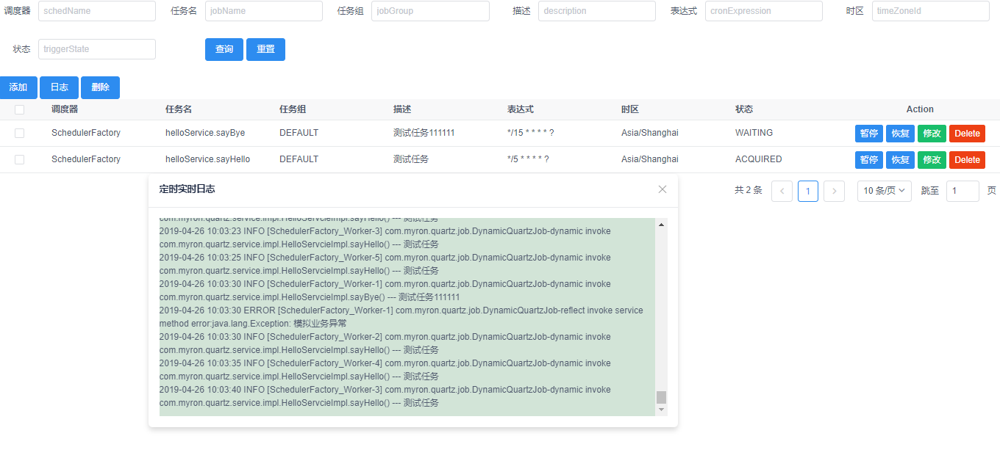

# springboot quartz集群 + 动态定时任务

功能预览:
- [x] 1.动态添加/删除/修改/启停定时任务及规则
- [x] 2.运行时配置任务作业,"0"开发
- [x] 3.定时日志实时显示    

## 正文

## 演示说明
### 开发模式(使用h2数据库)
    1. application.properties配置模式spring.profiles.active=dev
    2. 运行:com.myron.quartz.Application
### 生产模式(使用mysql数据库)
    1. mysql数据执行classpath:tables_mysql.sql 创建quartz相关表
    2. application-pro.properties 配置mysql数据链接
    3. application.properties 配置激活spring.profiles.active=pro
    4. 运行:com.myron.quartz.Application
### 界面访问
    1. 方式一: 内嵌页面: http://localhost:7070/
    2. 方式二: 前后分离: 复制front/quartz.html 右键浏览器打开
    
    
#### 默认任务
配置项目启动默认定时任务
```
@Component//被spring容器管理
@Order(1)//如果多个自定义ApplicationRunner，用来标明执行顺序
public class MyApplicationRunner implements ApplicationRunner {
    private static final Logger LOGGER = LoggerFactory.getLogger(MyApplicationRunner.class);
    @Autowired
    private QrtzJobDetailsService qrtzJobDetailsService;
    @Override
    public void run(ApplicationArguments applicationArguments) throws Exception {
        QrtzJobDetails qrtzJobDetails = new QrtzJobDetails();
        qrtzJobDetails.setJobName("helloService.sayHello");
        qrtzJobDetails.setCronExpression("*/5 * * * * ?");
        qrtzJobDetails.setDescription("测试任务");
        QrtzJobDetails qrtzJobDetails1 = new QrtzJobDetails();
        qrtzJobDetails1.setJobName("helloService.sayBye");
        qrtzJobDetails1.setCronExpression("*/15 * * * * ?");
        qrtzJobDetails1.setDescription("测试任务111111");
        LOGGER.info("add default time job:{}", JSON.toJSONString(qrtzJobDetails, SerializerFeature.PrettyFormat));
        LOGGER.info("add default time job:{}", JSON.toJSONString(qrtzJobDetails1, SerializerFeature.PrettyFormat));
        qrtzJobDetailsService.createQrtzJobDetails(qrtzJobDetails);
        qrtzJobDetailsService.createQrtzJobDetails(qrtzJobDetails1);

    }

}
```
